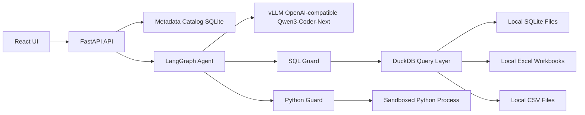

# Corporate Data Chat

Production-grade starter for an AI data analyst chat application over changing local SQLite databases, Excel workbooks, and CSV files.

The app uses:

- FastAPI backend with a metadata catalog, secure SQL validation, constrained Python analysis, and LangGraph orchestration.
- React + Vite + TypeScript frontend with streamed chat events, settings, datasource management, schema browsing, result tables, and chart rendering.
- vLLM OpenAI-compatible APIs serving `qwen3-coder-next`.
- DuckDB as the unified analytical query surface for Excel and cross-source analysis.

## Architecture



## Quick Start

1. Create a Python environment and install the backend.

```bash
cd backend
python -m venv .venv
source .venv/bin/activate
pip install -e ".[dev]"
cp ../.env.example .env
uvicorn app.main:app --reload --port 8000
```

2. Start the frontend.

```bash
cd frontend
npm install
npm run dev
```

3. Open `http://localhost:5173`.

4. In Settings, browse for or add one or more local `.sqlite`, `.db`, `.sqlite3`, `.xlsx`, `.xlsm`, `.xls`, `.csv`, or `.tsv` files.

## vLLM Configuration

The backend expects an OpenAI-compatible endpoint.

```bash
VLLM_BASE_URL=http://localhost:8000/v1
OPENAI_API_KEY=local-key
MODEL_NAME=qwen3-coder-next
```

The app also accepts `OPENAI_API_BASE` for compatibility. Runtime model URL, model name, temperature, and max tokens can be changed from the Settings page and are stored in the internal metadata database.

## Streaming

`POST /chat/stream` streams Server-Sent Events:

- `conversation`: conversation id assignment.
- `status`: visible execution steps such as Planning, Inspecting schema, Generating query, Validating, Executing, Critiquing answer, and Finalizing.
- `token`: streamed final answer chunks.
- `final`: full structured response with answer, SQL/code, artifacts, sources, caveats, and confidence.

## Safety Defaults

- SQLite files are inspected read-only.
- SQL execution rejects DML, DDL, DCL, multi-statement SQL, file/network functions, unknown tables, and unknown columns where statically verifiable.
- Excel workbooks and CSV files are normalized into canonical DuckDB tables while preserving source file/table/column metadata.
- Python code is AST-validated before execution, blocks unsafe imports/calls/attributes, runs in a separate constrained process, and receives data through approved table snapshots and `query(sql)`.
- Generated private chain-of-thought is not exposed. The UI shows concise reasoning summaries and auditable execution steps.

## Useful Commands

```bash
python scripts/create_sample_data.py
cd backend && pytest
cd frontend && npm run build
```

The sample-data script creates `.data/sample_sales.sqlite` and `.data/sample_sales.xlsx` for local smoke testing.
