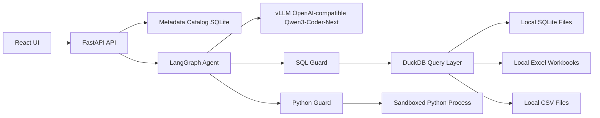

# Chat with Contracts

Production-grade contract chat application over a shared Excel-derived contract database plus per-user uploaded contract documents.

The app uses:

- FastAPI backend with a metadata catalog, secure SQL validation, constrained Python analysis, and LangGraph orchestration.
- React + Vite + TypeScript frontend with streamed chat events, settings, datasource management, schema browsing, result tables, and chart rendering.
- vLLM OpenAI-compatible APIs serving `qwen3-coder-next`.
- DuckDB as the unified analytical query surface for Excel and cross-source analysis.

## Architecture



## Quick Start

1. Create a Python environment and install the backend.

```bash
cd backend
python -m venv .venv
source .venv/bin/activate
pip install -e ".[dev]"
cp ../.env.example .env
uvicorn app.main:app --reload --port 8000
```

2. Start the frontend.

```bash
cd frontend
npm install
npm run dev
```

3. Open `http://localhost:5173`.

4. Sign in as an administrator, upload the contract database workbook in Settings, then ask questions in Chat. Standard users only see the chat workspace and their own uploaded documents.

## Offline Deployment Bundle

Build the offline bundle on an internet-connected Python 3.10 machine that matches
the target OS/CPU architecture:

```bash
python scripts/build_offline_bundle.py --chunk-mb 95 --easyocr-languages en
```

The builder downloads runtime Python wheels plus Docling and EasyOCR model assets,
then creates GitHub-friendly chunks under `offline/bundle/chunks/`, each below the
configured chunk size. Commit `offline/bundle/manifest.json` and
`offline/bundle/chunks/*.part*` if the offline bundle must live in GitHub.

On the offline target:

```bash
python scripts/install_offline_bundle.py
```

The installer verifies checksums, installs backend dependencies using only the
local wheelhouse, copies Docling/EasyOCR model assets into
`backend/.data/offline-assets/`, and writes the local model paths into
`backend/.env`. Runtime extraction is offline-only: EasyOCR is called with
`download_enabled=False`, and Docling uses the configured local artifact path.

## Cloudera Application Startup

For Cloudera-style deployments where only one local port is exposed, use the included
supervisor script. It starts FastAPI on a private loopback port and Vite on the
single exposed port with an `/api` proxy to the backend.

Default ports:

- Frontend/Vite: `http://127.0.0.1:8090`
- Backend/FastAPI: `http://127.0.0.1:8001`

Configure the public Cloudera host in `cloudera_app_config.json`:

```json
{
  "public_host": "your-dynamic-cloudera-host.example.com",
  "frontend_port_env": "CDSW_APP_PORT",
  "frontend_host": "127.0.0.1",
  "frontend_port": 8090,
  "backend_host": "127.0.0.1",
  "backend_port": 8001,
  "node_bin": "",
  "npm_bin": ""
}
```

At runtime, `start_app.py` prefers `CDSW_APP_PORT` over the configured
`frontend_port`, falls back to `CDSW_READONLY_PORT` if present, and then falls back
to `8090`. This matches Cloudera's documented application port model. The frontend
also exposes `GET /healthz`, so set the Cloudera application polling endpoint to:

```bash
CDSW_APP_POLLING_ENDPOINT=/healthz
```

Vite requires Node.js 18 or newer. If the Cloudera runtime has multiple Node
versions, set `node_bin` and `npm_bin` in `cloudera_app_config.json` or export
`NODE_BIN` and `NPM_BIN`.

Start in the foreground, which is usually what Cloudera process managers expect:

```bash
python start_app.py
```

For local/manual control:

```bash
./stop.sh
./restart.sh
```

Logs and the runtime PID file are written under `.data/`.

## vLLM Configuration

The backend expects an OpenAI-compatible endpoint.

```bash
VLLM_BASE_URL=http://localhost:8000/v1
OPENAI_API_KEY=local-key
MODEL_NAME=qwen3-coder-next
```

The app also accepts `OPENAI_API_BASE` for compatibility. Runtime model URL, model name, temperature, and max tokens can be changed from the Settings page and are stored in the internal metadata database.

## Streaming

`POST /chat/stream` streams Server-Sent Events:

- `conversation`: conversation id assignment.
- `status`: visible execution steps such as Planning, Inspecting schema, Generating query, Validating, Executing, Critiquing answer, and Finalizing.
- `token`: streamed final answer chunks.
- `final`: full structured response with answer, SQL/code, artifacts, sources, caveats, and confidence.

## Safety Defaults

- SQLite files are inspected read-only.
- SQL execution rejects DML, DDL, DCL, multi-statement SQL, file/network functions, unknown tables, and unknown columns where statically verifiable.
- Excel workbooks and CSV files are normalized into canonical DuckDB tables while preserving source file/table/column metadata.
- Python code is AST-validated before execution, blocks unsafe imports/calls/attributes, runs in a separate constrained process, and receives data through approved table snapshots and `query(sql)`.
- Generated private chain-of-thought is not exposed. The UI shows concise reasoning summaries and auditable execution steps.

## Useful Commands

```bash
python scripts/create_sample_data.py
cd backend && pytest
cd frontend && npm run build
```

The sample-data script creates `.data/sample_sales.sqlite` and `.data/sample_sales.xlsx` for local smoke testing.
